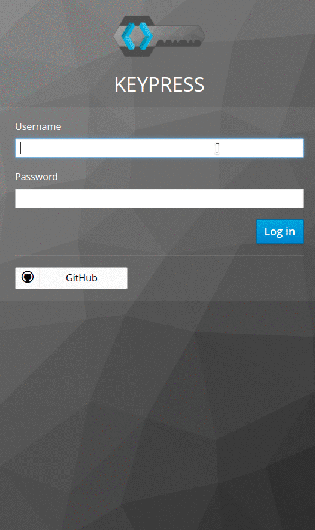

## Keyonic-V2
A Keycloak Mobile Implementation using Angular v4 and Ionic v3.

## Version 2 Enhancements
* Implementation with Angular 4/Typescript/Ionic 3
* ViewGuard - View level access is protected based on a Role
* More Keycloak functions used and information served

## Requirements
* Apache Cordova
* Node 6 LTS
* Ionic 3
* Keycloak Server

Install Cordova & Ionic
* `npm install -g ionic cordova`

Use Node 6
* `nvm use 6.9`

## Installation
Run `ionic serve --address localhost` to start the application.

**Note**: You must first have the Keycloak Server running with a configured Realm and Users:

You can import the keyonic-v2 Realm (`keyonic-v2-realm.json`) and Users (`keyonic-v2-users.json`) JSON files [here](https://github.com/TommyJ1994/keypress/tree/master/keycloak) to populate Keycloak with the correct configuration.

* Under the Realms section in Keycloak, add a new Realm with the Import option.
* Import the `keyonic-v2-realm.json` file.
* Once complete, visit the newly created realm and click the 'Import' button at the bottom left of the sidebar. You will import the users here. Choose the `keyonic-v2-users.json` file.

**Note**: You must first have a running Keycloak instance running as the Keycloak JS Adapter in the mobile app is being fetched from the Keycloak server itself, rather than via npm.

In this sample application, Keycloak is expected to be already running off `localhost:8080`. This can be changed however in `src/index.html` under ``

Ensure that you have the Web Origin configured in Keycloak. eg `*` or other. (This should be done when you import the realm)

Also ensure that the redirectUri for the client is pointing to where the ionic dev server is running. eg. `http://localhost:8100/*` (Only if your ionic app is running on a different URL)

## Usage

User Credentials:

* `keypress-admin/admin`

* `areader/123`

* `apublisher/123`

## Bearer Example
For an exmaple using bearer tokens for accessing a REST API, checkout the `bearer_example` branch here and in [Keypress#bearer_example](https://github.com/TommyJ1994/keypress)
